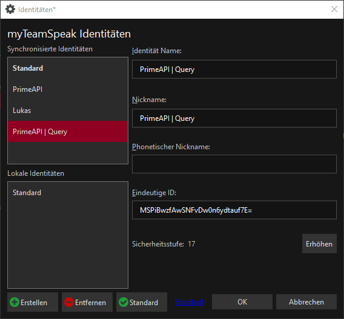
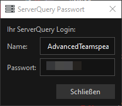
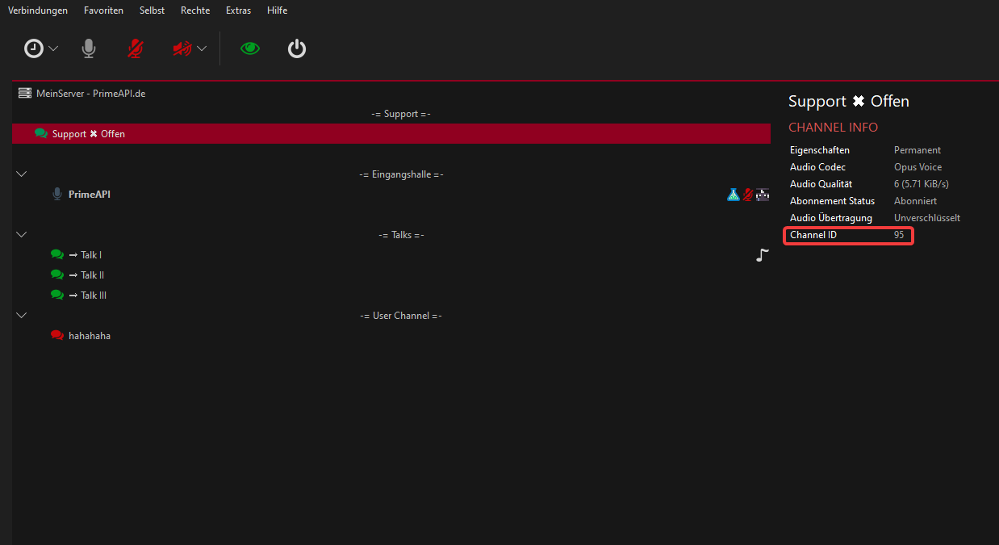
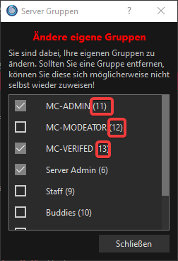

# Teamspeak-Bot

## Config

### Verbindung

Um eine Verbindung herstellen zu können musst du zunächst einen Query-Zugang erstellen

Damit sich der Bot auf deinen Server einloggen kann, musst du einen Query Zugang hinzufügen:

Erstelle dir zunächst eine neue Identität:\
Extras > Identitäten > Erstellen



Danach musst du dich mit dieser Identität auf deinen Server verbinden.\
Dann erstellst du dir einen Query Zugang:\
Extras > ServerQuery Login\
Dort gibst du einen Namne an, und klickst auf `OK`



Diese Daten müsst ihr nun in der config.yml eingeben

```
connection:
  host: 127.0.0.1
  username: AdwancedTeamspeak
  password: password
  port: 9987
  displayname: System Bot
```


Wenn ihr euren Ts³-Server nicht selbst hostet müsst ihr die Daten die ihr direkt von eurem Hoster erhalten habt eintragen


### Verifikation

**applyIcon** - Wenn aktiviert, wird einem Spieler sein Minecraft-Kopf als Client-Icon gesetzt wenn er sich **verifiziert** mit /link\
**applyDesc** - Wenn aktiviert, wird einem Spieler eine Beschreibung gesetzt, wenn er sich verifiziert\
**desc** - Gibt das Format der Beschreibung an\
**roles.verify** - Vergibt eine Gruppe, die immer beim verifizieren vergeben wird. Hier muss die ID der Gruppe angegeben werden\
**roles.roles** - Vergibt eine Gruppe anhand von permissions eines Spielers. Hier müssen die ID's der Gruppen angegeben werden


Es wird immer nur die höchste Gruppe vergeben. Auch wenn ein Spieler Permissions für weitere Gruppen hat


### Support

**use** - De/aktiviert die Funktion\
**notifyGroup** - Die ID der Gruppe welche benachrichtigt werden soll\
**notifyType** - Die Art die Benachrichtigung. Mögliche Angaben: POKE,MESSAGE\
**channel.id** - Die ID des Support-Channels\
**channel.open** - Der Name des Channels wenn er geöffnet ist. (/tssupport)\
**channel.closed** - Der Name des Channels wenn er geschlossen ist. (/tssupport)

## ID's herausfinden

### Channel-ID

Wenn man einen Channel anwählt, kann man dort Informationen über diesen einsehen



### Gruppen-ID

Gruppen Ids können im Servergruppen-Dialog eingesehen werden:\
Rechtsklick auf einen Spieler > Server Gruppe Setzen > Server Gruppen Dialog



